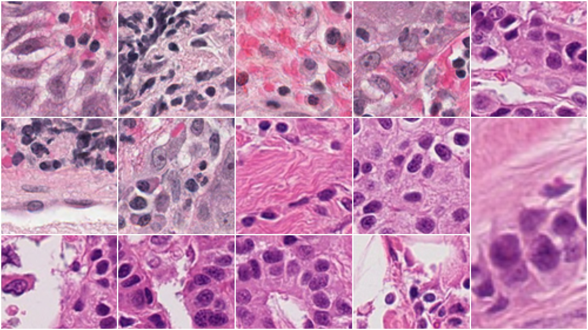

# [GSoC 2024 Project.](https://github.com/camicroscope/GSOC)

**Overview**
This project aims to leverage pre-trained and foundation AI models for patch-level classification in whole slide tissue images. The approach involves using these models as encoders to train task-specific models that classify image patches. Benefits include reduced training costs, less required training data, and potentially more accurate and robust models. The project will utilize models from Hugging Face and develop software to (1) search for and download pre-trained models, (2) choose a classification network, (3) train this network using the pre-trained model as the encoder, and (4) apply the trained model to image patches.

# 1. Specification of dependencies
```
git clone https://github.com/tkurc/wsi_classification_gsoc2024
cd code # go into code directory

# If you have GPU follow this:
conda update conda
conda env create -f environment.yml
conda activate camicro

# Don't have GPU!!! No worries follow this:
conda create -n camicro python=3.9 -y # Create fresh env
conda activate camicro
pip install -r requirements.txt 
```

# 2. Dataset
Training dataset by combining manually annotated patches(strong annotations)from 18 TCGA cancer types(ACC, BRCA,COAD, ESCA, HNSC, KIRC, LIHC, LUAD, MESO, OV, PAAD, PRAD, SARC, SKCM, TGCT, THYM, UCEC, and UVM) and model generated annotations from 4 TCGA cancer types (CESC, LUSC, READ, and STAD). For more details and download the dataset visit [here](https://zenodo.org/records/6604094).

<!--  -->



Upload the Whole slide images under `slides/{specific_folder}` and make sure when saving the `results` you select the folder from `results/{specific_folder}`.

Folder Strcuture.
```
code/
│
├── slides/
│   └── brca/
│       ├── TCGA-Brca-3C-AALI-01Z-00-DX1.F6E9A5DF-D8FB-45CF-B4BD-C6B76294C291.svs
│       └── ...  # List of other BRCA slide files
│   └── thym/
│       ├── TCGA-Thym-3G-AB19-01Z-00-DX1.ED755979-C885-4D7F-BF65-40088D398C32.svs
│       └── ...  # List of other THYM slide files
└── results/
│   └── brca/   # Analysis results for BRCA slides
│   └── thym/   # Analysis results for THYM slides   
└── datasets/
│   └── brca/   # BRCA Patches
│   └── thym/   # THYM Patches            
├── app.py      # Main application script
├── preprocess.py  # Script for preprocessing data
├── model_setup.py # Script for model setup
├── wsi_Infer.py   # Script for inference on whole slide images
├── training.py   # Script for training the model
├── README.md  # Your markdown file explaining the project
...
...
```

# 3. Run Demo
```
streamlit run app.py
```
